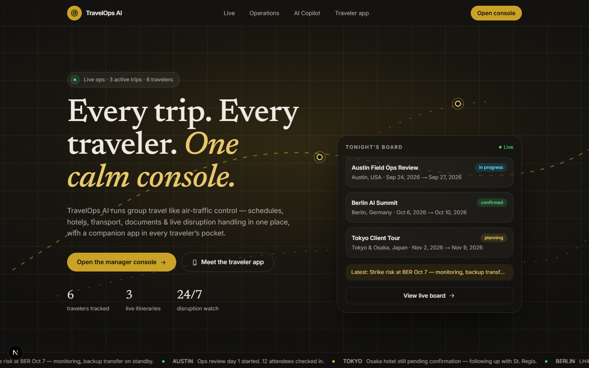
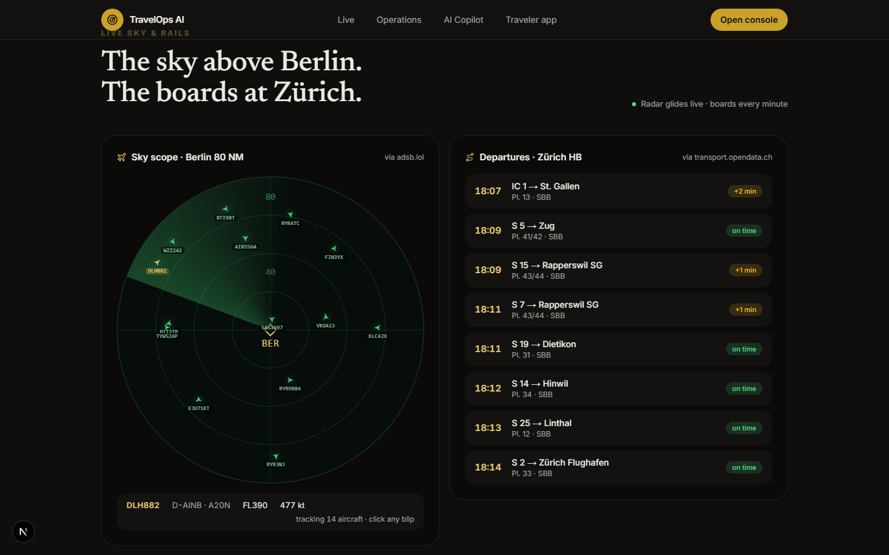

# TravelOps AI — Web + Mobile AI Product

One product, two apps, one API contract. An AI travel operations platform:
travel managers run a calm mission-control console on the web, travelers carry
a live companion app in their pocket.



## What it is

| Surface | Stack | Who it's for |
|---|---|---|
| **Marketing + live site** (`/`) | Next.js 16, Tailwind v4, Newsreader + Inter | Anyone — cinematic landing with real live data |
| **Manager console** (`/console`, `/trips`, …) | Next.js App Router, quiet-ops UI | Travel managers running group trips |
| **Traveler app** (`apps/mobile`) | Expo ~57, expo-router, React Native | Travelers — itinerary, docs, contacts, updates |
| **Shared contract** (`packages/shared`) | TypeScript | Both apps speak the same API |



**Live sky & rails (no API keys):** the front page plots real aircraft over Berlin
on an ATC-style radar scope (community ADS-B via `adsb.lol`, click any blip to
track it) next to live Zürich HB departures (open Swiss timetable via
`transport.opendata.ch`). Both refresh automatically through tiny proxy routes
at `/api/live/flights` and `/api/live/trains`.

**Manager console:** KPI hierarchy (one hero number, everything else subordinate),
trip boards, realtime disruption wire (SSE + polling fallback), and an AI
copilot that summarizes itineraries and drafts numbered replan steps from live
trip data — with heuristic fallback when no `OPENAI_API_KEY` is set.

## Quickstart

### Web

```bash
cd apps/web
npm install
cp .env.example .env.local   # DATABASE_URL, OPENAI_API_KEY (both optional for demo)
npm run dev                  # http://localhost:3000
```

### Mobile (Expo Go)

```bash
cd apps/mobile
npm install
cp .env.example .env   # EXPO_PUBLIC_API_URL=http://localhost:3000 (LAN IP for devices)
npx expo start
```

Scan the QR with Expo Go. Tabs: Itinerary · Schedule · Documents · Contacts ·
Updates. If the API is unreachable the app falls back to `lib/mock.ts`, so it
works fully offline.

## API

All web routes run on an in-memory store today and carry
`// Production: replace with Prisma` markers — swap the store calls for Prisma
Client calls when `DATABASE_URL` is set (schema: `apps/web/prisma/schema.prisma`,
9 models: trips, participants, schedules, hotels, transport, documents,
contacts, notes, updates).

| Method | Route | Notes |
|---|---|---|
| GET/POST | `/api/trips` | List + create |
| GET/PATCH/DELETE | `/api/trips/[id]` | Detail, update, delete |
| GET/POST | `/api/trips/[id]/participants\|schedule\|hotels\|transport\|documents\|contacts\|notes` | Sub-resources |
| GET/POST | `/api/updates` | Realtime wire |
| GET | `/api/updates/stream` | SSE stream |
| POST | `/api/ai/itinerary-summary` | `{ tripId }` → `{ summary, source }` |
| POST | `/api/ai/replan` | `{ tripId, disruption }` → `{ suggestions[], source }` |
| GET | `/api/live/flights` | Live aircraft near Berlin (adsb.lol) |
| GET | `/api/live/trains` | Live Zürich HB departures (transport.opendata.ch) |

## Deploy

### Web (Vercel)

- Root directory: `apps/web` · Build: `npm run build`
- Env: `DATABASE_URL` (Postgres), `OPENAI_API_KEY` (optional — heuristics otherwise)

### Mobile (Expo / EAS)

`apps/mobile/eas.json` ships `development`, `preview` (APK), and `production`
profiles.

```bash
cd apps/mobile
npm i -g eas-cli
eas login
eas init --id                          # link slug travelops-traveler
eas build --platform android --profile development
eas build --platform all --profile preview
eas build --platform all --profile production
eas submit --platform all --latest
```

Point `EXPO_PUBLIC_API_URL` at the deployed web URL (EAS env / secrets) before
production builds so the app talks to production, not localhost.

## Repo layout

```
apps/web/src/app/            landing (/), console (/console), trips/[id], ai, …
apps/web/src/app/api/        REST + SSE + AI + live proxy routes
apps/web/src/components/     landing sections, radar scope, console UI, icons
apps/web/prisma/             Postgres schema
apps/mobile/app/             expo-router: index + (tabs)/itinerary,schedule,…
apps/mobile/lib/             types, mock data, API client, TripContext
packages/shared/src/         canonical TypeScript contract
docs/media/                  screenshots
```

## Data sources & attribution

- Flights: [adsb.lol](https://adsb.lol) community ADS-B feed (keyless, fair-use polling)
- Trains: [transport.opendata.ch](https://transport.opendata.ch) Swiss open timetable (keyless)
- Demo trips travel with seed data — no real travelers harmed.

## Verification

- `apps/web`: `npx tsc --noEmit` clean · `npm run lint` clean · `npm run build` clean
- `apps/mobile`: `npx tsc --noEmit` clean
- Windows note: `create-next-app`'s writability check fails on paths containing
  `+`/spaces, so the web app was scaffolded in `%TEMP%` and moved here. Run
  `npm install` per-app rather than from the repo root if workspaces misbehave.
